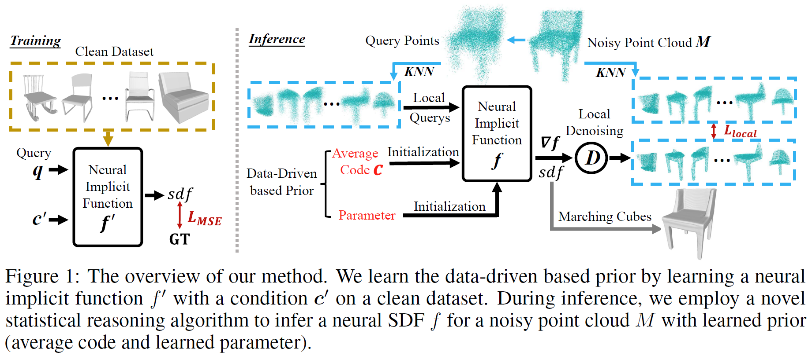

# Inferring Neural Signed Distance Functions by Overfitting on Single Noisy Point Clouds through Finetuning Data-Driven based Priors (NeurIPS 2024)

### [Project](https://arxiv.org/pdf/2410.19680) | [paper (NeurIPS)](https://arxiv.org/pdf/2410.19680) 

## Citation

If you find this project useful in your research, please consider citing:

```
@inproceedings{chen2024localn2nm,
  author = {Chao Chen and Zhizhong Han and Yu-Shen Liu},
  title = {Inferring Neural Signed Distance Functions by Overfitting on Single Noisy Point Clouds through Finetuning Data-Driven based Priors},
  booktitle = {Advances in Neural Information Processing Systems (NeurIPS)},
  year = {2024},

```



## Training and Evaluation
```
./run.sh
```